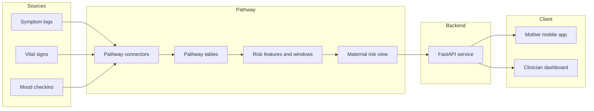

# BloomGuard Architecture

```mermaid
flowchart LR
  subgraph Sources
    symptoms[Symptom logs]
    vitals[Vital signs]
    mood[Mood checkins]
  end

  subgraph Pathway
    connector[Pathway connectors]
    table[Pathway tables]
    features[Risk features and windows]
    riskview[Maternal risk view]
  end

  subgraph Backend
    api[FastAPI service]
  end

  subgraph Client
    motherApp[Mother mobile app]
    clinicianDash[Clinician dashboard]
  end

  symptoms --> connector
  vitals --> connector
  mood --> connector

  connector --> table --> features --> riskview

  riskview --> api
  api --> motherApp
  api --> clinicianDash
```

You can screenshot this for your hackathon slides.
